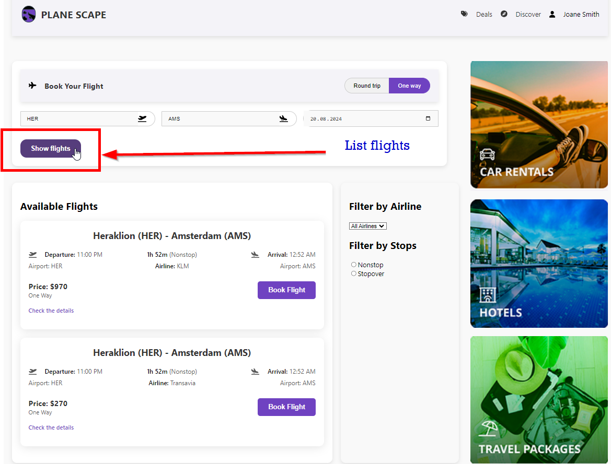
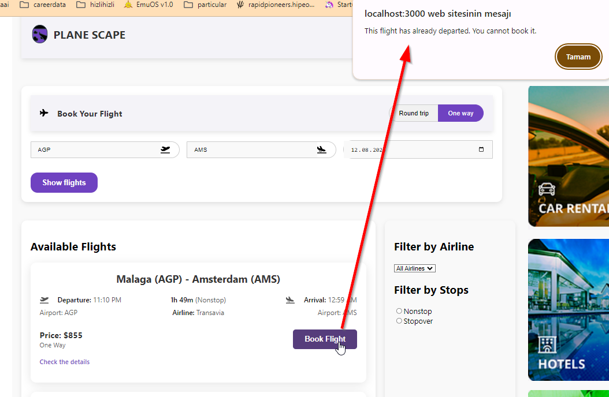
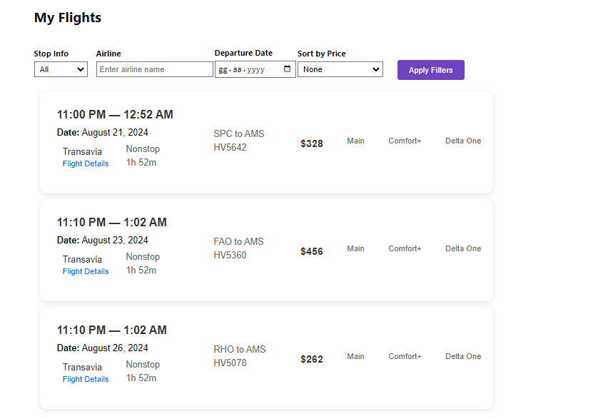
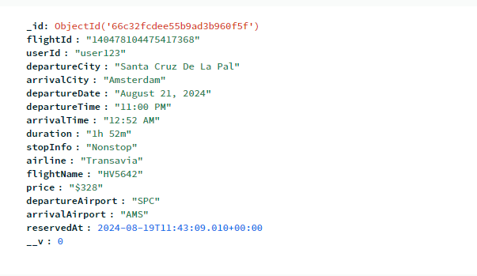

# Plane Scape

## Table of Contents

- [Introduction](#introduction)
- [Technologies Used](#technologies-used)
- [Minimum Requirements](#minimum-requirements)
- [Setup Instructions](#setup-instructions)
- [Running the Application](#running-the-application)
- [Features](#features)
- [Development](#development)
- [Contributing](#contributing)
- [License](#license)

## Introduction

Plane Scape is a web application that allows users to search for flights, view flight details, and make reservations. The project is built with a React frontend and a Node.js/Express backend.

This project fetches flight data from the Schiphol Airport API, allowing users to search, list, filter, and book flights based on their preferences. Users can select departure and arrival points, specify travel dates, and apply various filters to find the most suitable flights. The application provides a seamless experience for booking flights and managing reservations.

## Technologies Used

### Client

- React
- React Router
- Axios
- FontAwesome
- Moment.js
- React Query

### Server

- Node.js
- Express
- Mongoose
- Axios
- Dotenv

### Development Tools

- ESLint
- Prettier

## Minimum Requirements

- Node.js v14 or higher
- npm v6 or higher

## Setup Instructions

1. Clone the repository:

   ```sh
   git clone https://github.com/remre/appfellas_study.git
   cd appfellas_assignment
   ```

2. Install dependencies for both client and server:

   ```sh
   # For client
   cd client
   npm install

   # For server
   cd server
   npm install
   ```

3. Create a `.env` file in the `server` directory and add the necessary environment variables:
   ```env
   MONGO_URI=your_mongodb_connection_string
   PORT=5000
   SCHIPHOL_API_ID=your_schiphol_api_id
   SCHIPHOL_API_KEY=your_schiphol_api_key
   ```

## Running the Application

### Client

To start the client-side application, navigate to the `client` directory and run:

```sh
npm start

```

### Server

To start the client-side application, navigate to the `server` directory and run:

```sh
npm run dev


```

## Features

- Select departure and arrival points for the desired date.
- View results and filter by price, airline, time, and number of stops.
- Booking is not allowed if the flight date has passed.
- On the My Flights page, filter by airline, stop info, price, and flight date.






## Contributing

Contributions are welcome! Please fork the repository and create a pull request with your changes.

## License

This project is licensed under the MIT License.
